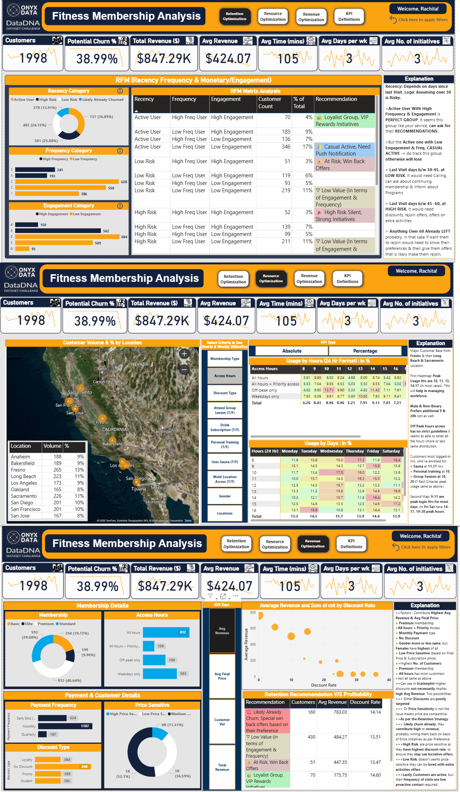

🏋️‍♂️ Customer Retention & Revenue Optimization Dashboard

This repository contains the work I did for the Onyx Data DNA Challenge (August 2025).
The goal was to analyze a Fitness Membership dataset to uncover insights around customer retention, resource utilization, and revenue optimization.

📂 Repository Contents

data/ → Dataset provided for the challenge

scripts/ → Python scripts for preprocessing and exploratory analysis

dashboard/ → Power BI file (.pbix) containing interactive dashboard

images/ → Screenshots of dashboard tabs

📊 Dashboard Highlights
1. Retention Tab

    Recency-based segmentation of members into Active, Low Risk, High Risk, and Likely Churn.
    
    Intervention strategies for each segment:
    
    Active → Ask for referrals
    
    Low Risk (30–45 days) → Proactive contact
    
    High Risk (45–60 days) → Targeted discounts

    Likely churn (>60 days) → Personalized reactivation offers

2. Resource Utilization Tab

    Heatmaps of peak gym usage hours (10, 11, 13, 14, 17 hrs).
    
    Insights into gender preferences & program-specific peaks (Sauna, Training, Group Sessions).
    
    Location analysis: Fresno, Long Beach, and Sacramento as key hubs.

3. Revenue Optimization Tab

    Premium memberships & monthly payments drive highest average revenue.
    
    Discounts not always effective → possible poor targeting or competitive pricing.
    
    Females contribute slightly higher avg revenue.
    
    Scatterplot analysis: High-risk members = most price-sensitive.

⚙️ Tech Stack

    Power BI → Dashboard creation, bookmarks, RFM segmentation, scatterplots
    
    Python → Data preprocessing, exploratory analysis
    
    Pandas, Matplotlib → Additional checks & transformations

📷 Dashboard Preview 
Awarded Problem Solver 📷 Dashboard Preview 
🚀 How to Use

Clone the repository:

git clone https://github.com/<your-username>/<repo-name>.git

Explore dataset (/data).

Run preprocessing with Python scripts (/scripts).

Open the Power BI file in /dashboard to view the interactive report.

🙏 Acknowledgements

This work was created as part of the Onyx Data DNA Challenge – August 2025
, supported by:

Onyx Data

ZoomCharts

Enterprise DNA

BCS, The Chartered Institute for IT

Smart Frames UI

Data Career Jumpstart

📌 Author

👤 Rachita

LinkedIn: https://www.linkedin.com/in/rachita-ai-enthusiast

LinkedIn Post: https://www.linkedin.com/posts/rachita-ai-enthusiast_powerbi-datadna-analytics-activity-7365479353457025024-YJbr?utm_source=share&utm_medium=member_desktop&rcm=ACoAACq54EUBoF_nzCPWo1lI6wATBE_l_Kydrdc

Power BI: https://app.powerbi.com/groups/me/reports/23d5714b-8193-40d6-acc9-a4f492157675/bc4adfb00b402d417226?experience=power-bi

